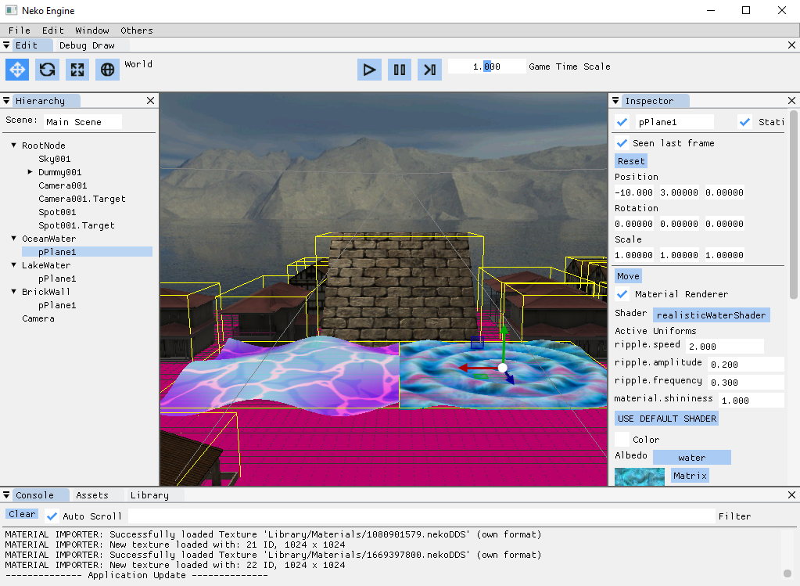
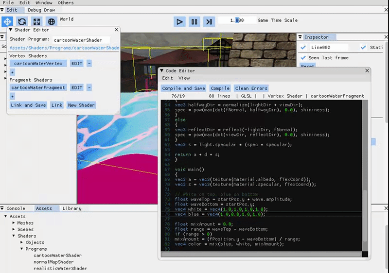

# Neko Engine

Neko Engine is a 3D game engine currently being developed by two students from CITM-UPC Terrassa, Sandra Alvarez and Guillem Costa. The entire development has been supervised by the lecturer Ricard Pillosu.

The code is written in C++.

<br>

- GitHub repository: [NekoEngine](https://github.com/WickedNekomata/NekoEngine)

## Team

<br>

- Our GitHub organization: [WickedNekomata](https://github.com/WickedNekomata)

### Sandra Alvarez
Sandra's GitHub account: [Sandruski](https://github.com/Sandruski)

- Time Management (Play, Pause, Tick)
- Quadtree and Frustum Culling
- Camera
- Resource Manager (offline)
- FileSystem
- ImGui panels
- Shaders
- Importers and import options
- Multitexturing
- Assets and Library
- Bounding Boxes
- Gizmos

### Guillem Costa
Guillem's GitHub account: [DatBeQuiet](https://github.com/DatBeQuiet)

- Json (Parson)
- Save and Load
- Game Objects and components
- Resource Manager (online)
- FileSystem
- ImGui panels
- Shaders
- Selection
- Mouse picking
- Skybox
- Docking
- Game.exe
- Gizmos

## Main Core Sub-Systems

For the team, it was super important to keep every sub-system as simple as possible, but always with the maximum efficiency that we could obtain.

### Game Objects (Entity-Component-Pattern)
To implement the Game Objects, we followed the Entity-Component-Pattern, since it is modular.
The components that can be attached are: Transform Component, Mesh Component, Material Component and Camera Component.


As you can see in the image above, there is a main class called 'GameObject' that has instances for every component attached.
These instances are virtual classes that inherit from a base class called 'Component'.

If we implement a n-child tree of game objects using this Entity-Component-Pattern we get a Unity-like Game Objects system. 

### Resource Manager (Reference Counting, Library and Metas)
The Resource Manager takes care of the resources, which are: Mesh Resource, Material Resource, Shader Object Resource and Shader Program Resource. 

We wanted to achive an easy but efficient way to manage vram. The best way to do it was using a Reference Counting system. Basically, the Resource Manager keeps track of every Resource and, thanks to a variable stored in them, we can count every reference to them. When a Resource goes from 0 to 1 references we load it to memory. The same goes when the references down from 1 to 0, but, in this case, we unload it from memory.

Due to the amount of data stored in a model (FBX, etc.), some formats are very slow to read. In order to fix this issue, we store all the meshes in our own simple format in the Library folder. The same concept is applied for every resource so, at the end of the day, the time required for loading a scene is reduced by far.

We also wanted to allow the user to manage their assets in a Unity-style way. In order to approach it, .metas joined the party. A .meta is a text file that stores the properties of a resource and its UUID (unique identifier) and works as a link between the asset and the resource.

### GUI (using ImGui)
In any game engine an easy-to-use UI is a must and, thanks to the ImGui library, this was super fast an simple to implement.
The way we did it was having a GUI module that works as a manager for all ImGui panels. To approach the Inspector panel, we implemented an OnEditor method at each component so, when a game object is selected, we draw its components on the Inspector.

## Shaders Sub-System
The engine uses a Shader Pipeline to render.

<br>
 
Each mesh has its own VBO, IBO and VAO. The VBO contains positions, normals, colours, texture coordinates, tangents and bitangents.
To manage the data, compilation and linking of shaders, we have the Shader Object and the Shader Program classes. 
To edit shaders, we have the Shader Editor panel and the Code Editor panel.


[Image Source](https://developer.apple.com/library/archive/documentation/GraphicsImaging/Conceptual/OpenGL-MacProgGuide/opengl_shaders/opengl_shaders.html)

### Shader Objects
New Shader Objects (Vertex or Fragment) can be created from the Assets panel. The Code Editor panel allows to edit them.
We can Compile them and Save them wihout having compiled.

### Shader Programs
New Shader Programs can be created from the Shader Editor panel. Shader Programs are created with one or more Vertex and Fragment shaders.
If all the Shader Objects that form a Shader Program compile, we can Link and Save the Shader Program.

Shader Programs are used by the Component Material of the meshes.
Each mesh has its own Shader Program.
From the Component Material, the Shader Program used by a mesh can be changed. Shader Programs that not link cannot be used.
If a mesh has no Shader Program, it will use the default one.

### Default Shader

The Default Shader is hardcoded in the engine.

#### Default Vertex Shader
The Default Vertex Shader simply calculates the final position of the vertex. 
It also sends to the default fragment shader the position, normal, texture coordinate and colour.

#### Default Fragment Shader
The Default Fragment Shader uses the albedo and specular textures of the Component Material.
After retrieving the colour from them, it calculates the final colour of the mesh by applying the Blinn-Phong pixel lighting.
This lighting model uses a Directional Light, which allows to calculate the Ambient, Diffuse and Specular colours of the light.

### Component Material
The Component Material is automatically created when the Component Mesh is added to a game object.
Since it allows multitexturing, it has the Ambient, Specular and Normal Map textures. 
Depending on the Shader Program used by the Component Material, it will use more or less textures to calculate the position and the colour of each of the vertices of the mesh.

### Uniforms
If the Shader Program used by the Component Material has Uniforms, they will appear in the Inspector. From there, they can be modified in real-time.
The simplicity of these modifications allows to try lots of values and achieve the best combinations in the Shader Programs.

<br>

### Binary Shader Loading
When a new Shader Program is linked and saved, we automatically generate its Shader Binary. 
Every time we open the engine, we try to load this Shader Binary. If the loading fails, we Compile its Shader Objects and Link the Shader Program again.

## Other Features
- Time Management
- Raycast
- Quadtree and Frustum Culling
- Camera Editor
- Scene Serialization
- Importers (Scene, Material and Shaders)
- Event System
- Mouse Picking
- FileSystem

## Video

<iframe width="560" height="315" src="https://www.youtube.com/embed/DVAqsAiQ2Us" frameborder="0" allow="accelerometer; autoplay; encrypted-media; gyroscope; picture-in-picture" allowfullscreen></iframe>

## Source code and latest release

- Source: [NekoEngine](https://github.com/WickedNekomata/NekoEngine)

- Latest Release: [NekoEngine](https://github.com/WickedNekomata/NekoEngine/releases/tag/Assignment3.0)

### Tools used to develop the engine

- IDE: Microsoft Visual Studio 2017
- External libraries: 
	- SDL 2.0.8
	- OpenGL 3.1
	- Glew 2.1
	- Assimp 4.1
	- DevIL 1.8
	- ImGui 1.66 WIP
	- ImGuiColorTextEdit 1.0
	- ImGuizmo 1.0
	- MathGeoLib 1.5
	- PCG Random Number Generator 0.94
	- Parson
	- PhysFS 3.0.1
	- MMGR
	- ImGuiColorTextEdit

## License

```
MIT License

Copyright (c) 2018 WickedNekomata (Sandra Alvarez & Guillem Costa)

Permission is hereby granted, free of charge, to any person obtaining a copy
of this software and associated documentation files (the "Software"), to deal
in the Software without restriction, including without limitation the rights
to use, copy, modify, merge, publish, distribute, sublicense, and/or sell
copies of the Software, and to permit persons to whom the Software is
furnished to do so, subject to the following conditions:

The above copyright notice and this permission notice shall be included in all
copies or substantial portions of the Software.

THE SOFTWARE IS PROVIDED "AS IS", WITHOUT WARRANTY OF ANY KIND, EXPRESS OR
IMPLIED, INCLUDING BUT NOT LIMITED TO THE WARRANTIES OF MERCHANTABILITY,
FITNESS FOR A PARTICULAR PURPOSE AND NONINFRINGEMENT. IN NO EVENT SHALL THE
AUTHORS OR COPYRIGHT HOLDERS BE LIABLE FOR ANY CLAIM, DAMAGES OR OTHER
LIABILITY, WHETHER IN AN ACTION OF CONTRACT, TORT OR OTHERWISE, ARISING FROM,
OUT OF OR IN CONNECTION WITH THE SOFTWARE OR THE USE OR OTHER DEALINGS IN THE
SOFTWARE.
```
